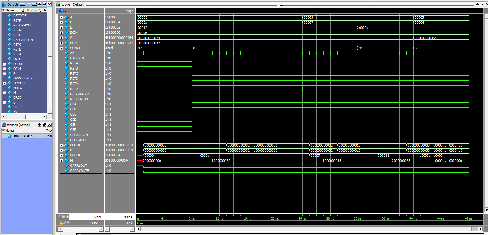

# Spartan6---DSP48A1
# DSP48A1 Slice Implementation in Verilog

A high-performance, modular implementation of the **Xilinx DSP48A1 slice** architecture. This project replicates the specialized hardware found in 7-series FPGAs, designed to accelerate intensive arithmetic operations.

---

## 🏗 Architecture Overview
The DSP48A1 slice is a versatile computational building block. This implementation supports:
* **18-bit Pre-adder:** Optimized for symmetric FIR filters.
* **18 x 18 Multiplier:** Two's complement signed multiplication.
* **48-bit Post-adder/Accumulator:** Supports 48-bit addition, subtraction, and logic functions.
* **Cascading Ports:** Logic for `BCIN/BCOUT` and `PCIN/PCOUT` to facilitate multi-slice chaining for large-scale DSP blocks.


---

## 🚀 Key Features
* **Pipelining:** Fully configurable pipeline registers (MREG, PREG, etc.) to maximize $F_{max}$.
* **OpMode Switching:** Dynamic control signals to change ALU operations on every clock cycle.
* **Low Latency:** Optimized data paths for critical DSP loops.
* **Verification:** Comprehensive testbench included for edge-case arithmetic validation.

---

## 📊 Simulation & Results
The following waveforms demonstrate the multiplier-accumulator (MAC) functionality and the transition between different OPMODES.

### Functional Waveform

*Figure 1: Timing diagram showing 48-bit accumulation and pre-adder results.*

### Synthesis Report (Optional)

*Figure 2: Resource utilization and timing slack from Vivado/Quartus.*

---

## 🛠 Getting Started

### Prerequisites
* **Simulator:** Icarus Verilog, ModelSim, or Vivado.
* **Waveform Viewer:** GTKWave or Vivado Logic Analyzer.

### Installation & Execution
1. **Clone the repo:**
   ```bash
   git clone [https://github.com/yourusername/DSP48A1-Verilog.git](https://github.com/yourusername/DSP48A1-Verilog.git)
   cd DSP48A1-Verilog
